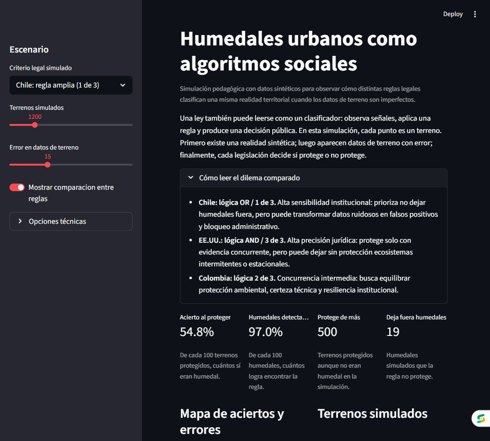
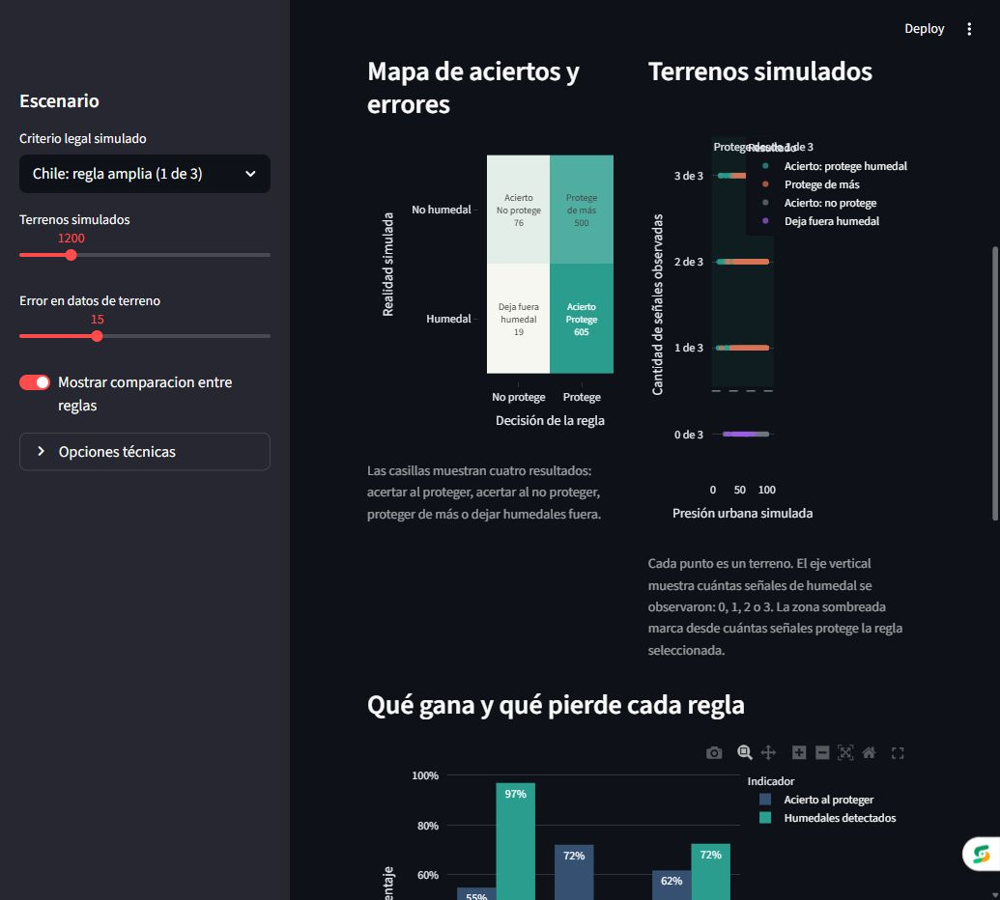
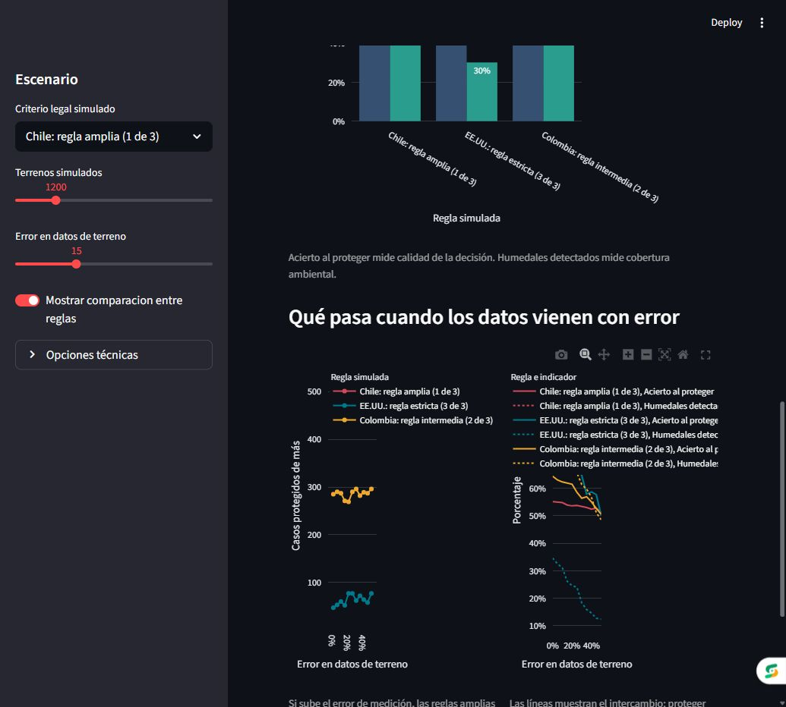

# Urban Wetlands as Social Algorithms

Interactive Streamlit simulation about comparative public policy, imperfect
data, and institutional decision-making.

This project treats a legal rule as a classifier: it observes signals, applies a
decision rule, and produces a public outcome. It does not attempt to identify
real wetlands or replace legal/environmental expertise. Its purpose is to make a
policy design problem visible: no rule is perfect; every rule distributes errors.

The project is part of a professional portfolio focused on political science,
data science, behavioral analysis, and applied AI. The goal is not to present a
pure software engineering exercise, but to show how a public policy question can
be translated into an explainable, measurable, and communicable data product.

> Note: the app interface is intentionally written in Spanish because the case is
> framed around Chilean and Latin American public policy debates.

## App Preview

The app lets users change the simulated legal criterion, the number of synthetic
land parcels, and the level of error in field data. The point is not to build a
decorative dashboard, but to show how institutional error changes when the rule
changes.







## Core Idea

Environmental legislation can be read as a social algorithm. It receives field
data, applies criteria, and decides whether a site should be protected. The
problem emerges when field data are imperfect: a broad rule can prevent
irreversible environmental harm, but it can also amplify technical errors and
create unjustified administrative blockages.

The question is not which country has the "correct" rule. The question is what
type of error each institutional design is willing to tolerate.

## Three Comparative Rules

The rules below are simplified classifiers derived from primary legal and
institutional sources. The source mapping is documented in
[docs/legal_sources/README.md](docs/legal_sources/README.md), including the
important caveat that Colombia's `2 of 3` rule is a pedagogical abstraction of a
multicriteria approach, not a literal statutory formula.

| Case | Simulated rule | Institutional bias | Main risk |
|---|---:|---|---|
| Chile | 1 of 3 criteria | High sensitivity / high recall | False positives: over-protection |
| United States | 3 of 3 criteria | High legal precision | False negatives: missed wetlands |
| Colombia | 2 of 3 criteria | Intermediate concurrence | Imperfect balance between both errors |

### Chile: OR Logic / 1 of 3

The broad rule is designed to avoid irreversible environmental harm. In
classification language, it maximizes sensitivity or recall: it prefers to catch
almost everything rather than risk leaving a wetland unprotected.

The cost is that, if technical or municipal data are noisy, a single erroneous
signal can activate protection. In practice, this may create false positives:
vacant or low-ecological-value sites blocked by mistake, with consequences for
housing, public investment, and urban management.

### United States: AND Logic / 3 of 3

The strict rule requires full concurrence of criteria. Its priority is legal
certainty and private property protection: a site is protected only when the
observed evidence is strong.

The cost appears on the opposite side. By requiring too much evidence, the rule
may leave intermittent, seasonal, or hard-to-observe ecosystems unprotected. In
confusion-matrix terms, it reduces false positives but increases false
negatives.

### Colombia: 2 of 3 Logic

The intermediate rule seeks a concurrence-based solution: one isolated signal is
not enough, but perfect evidence across all criteria is not required either. It
tries to balance environmental protection, technical certainty, and institutional
resilience under imperfect data.

## The Experiment: Noise in Field Data

The app includes a control called `Error en datos de terreno` ("field-data
error"). This parameter is central to the argument.

When observed data contain noise, Chile's broad rule does not merely become more
sensitive: it can amplify error in a non-linear way. A measurement problem then
becomes a bureaucratic problem. Technical uncertainty turns into administrative
arbitrariness and project paralysis.

This is the key pedagogical hypothesis of the project: institutional rules
cannot be evaluated without simulating the quality of the data on which those
rules operate.

## How To Read The Metrics

| App metric | Technical equivalent | Public policy interpretation |
|---|---|---|
| `Acierto al proteger` | Precision | Of what the State protects, how much actually deserved protection |
| `Humedales detectados` | Recall | Of all simulated wetlands, how many the rule manages to detect |
| `Protege de más` | False positives | Administrative, urban, or social costs of over-regulation |
| `Deja fuera humedales` | False negatives | Risk of unprevented environmental damage |

The confusion matrix makes the trade-off visible. A legal rule does not simply
produce right or wrong decisions. It produces different types of error, and each
type of error has political, social, and territorial consequences.

## From Public Policy To Product Thinking

This is not a product analytics project. Its core is comparative public policy.
However, the precision/recall logic transfers naturally to digital product
design, especially when teams make automated decisions about human behavior.

Fraud prevention systems, paywalls, moderation tools, risk scoring, and business
rules also classify behavior under imperfect data. If tracking data are noisy and
a rule is too aggressive, false positives may block legitimate users, destroy
trust, or increase churn. Analytically, this is similar to a poorly calibrated
law that treats non-risk cases as risk and blocks legitimate urban projects.

The connection does not change the topic of the project. It shows a broader
professional capability: reasoning about rules, incentives, behavior, and error
across both public institutions and digital products.

## What This Project Demonstrates

- Translating a political science problem into a reproducible data simulation.
- Using classification metrics to explain public policy trade-offs.
- Building an interactive app for executive, pedagogical, and portfolio use.
- Connecting institutional design with product, behavioral, and decision-rule
  thinking.
- Communicating complex analysis to mixed audiences: public policy, data, AI,
  product, and business.
- Using Python, Streamlit, Plotly, automated tests, and documentation as a
  lightweight analytical stack.
- Applying agentic AI as a technical accelerator in a human-in-the-loop workflow.

## How It Was Built: Vibe Coding With Analytical Direction

This project also documents a way of working: using agentic AI tools to turn an
analytical intuition into a functional application.

It is not framed as a traditional software engineering showcase. Instead, it is
an example of AI-assisted technical direction: defining the substantive question,
translating it into rules and metrics, iterating with Codex on code and
documentation, and keeping human judgment in charge of interpretation.

The workflow combined:

- A substantive question from comparative political science.
- Translation of the problem into synthetic data, legal rules, and a confusion
  matrix.
- Iteration with Codex to structure code, visualizations, tests, and written
  explanation.
- Human review of assumptions, framing, narrative, and interpretation.

That workflow is part of the value of the project. It shows how an analytical
profile can use AI to produce publishable technical artifacts without claiming to
be a software engineer. The core skill is directing data and AI tools toward a
meaningful public policy and behavioral decision-making question.

## Repository Structure

```text
humedales-politica-comparada/
|-- app.py
|-- README.md
|-- requirements.txt
|-- requirements-dev.txt
|-- data/
|   `-- synthetic_wetlands.csv
|-- docs/
|   |-- GUIA_DEMO_ENTREVISTA.md
|   |-- GUIA_EXPLICACION_LINKEDIN.md
|   |-- deploy_log.md
|   |-- legal_sources/
|   |   `-- README.md
|   `-- assets/
|       |-- app-overview.png
|       |-- app-comparacion-reglas.png
|       `-- app-ruido-datos.png
|-- notebooks/
|   `-- 01_exploracion_conceptual.ipynb
|-- src/
|   |-- data_generator.py
|   |-- legal_rules.py
|   |-- metrics.py
|   `-- visualization.py
`-- tests/
    `-- test_policy_simulation.py
```

## How To Run Locally

Anyone who wants to test the project locally can clone the repository, install
the dependencies, and launch the Streamlit app:

```powershell
git clone https://github.com/dellacroce-NRC/humedales-politica-comparada.git
cd humedales-politica-comparada
python -m pip install -r requirements.txt
python -m streamlit run app.py
```

Then open:

```text
http://localhost:8501
```

## Run Tests

```powershell
python -m pip install -r requirements-dev.txt
$env:PYTHONDONTWRITEBYTECODE='1'
python -m pytest tests -q -p no:cacheprovider
```

## Limitations

- Synthetic dataset, not real geographic evidence.
- Simplified legal rules for pedagogical purposes, with source mapping in
  [docs/legal_sources/README.md](docs/legal_sources/README.md).
- Not a scientific, legal, or production classifier.
- Legal fidelity could still be improved with expert validation and richer
  jurisdiction-specific modeling.

## Publication Status

- Repository: `dellacroce-NRC/humedales-politica-comparada`
- Streamlit Cloud app: pending deployment
- Intended use: professional portfolio, LinkedIn post, and interviews
